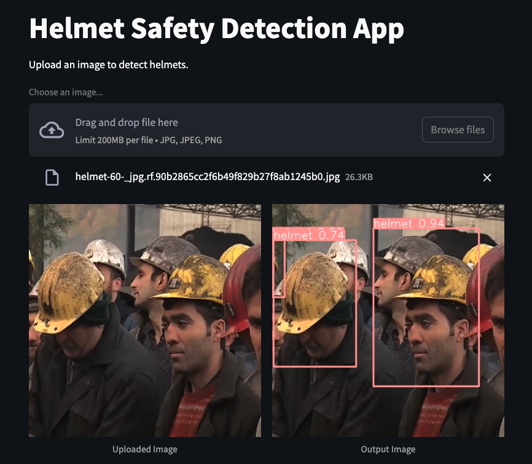
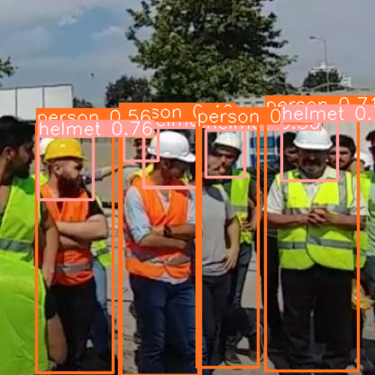
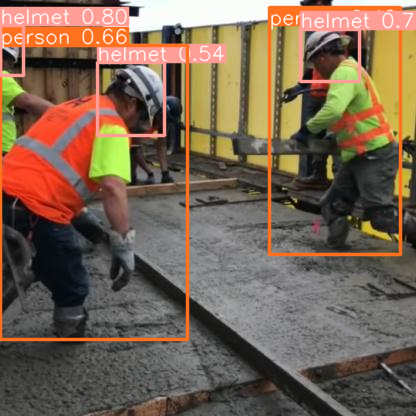
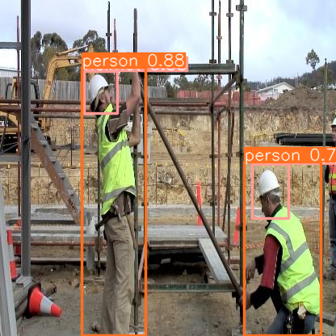

# Helmet Safety Detection with YOLOv10

This project aims at detecting helmets in images. This project utilizes the YOLOv10 model for performing real-time object detection and is built using Python and Streamlit for the web interface.

## Table of Contents

- [Features](#features)
- [Installation](#installation)
- [Usage](#usage)
- [Project Structure](#project-structure)
- [Demo](#demo)
- [License](#license)
- [Acknowledgements](#acknowledgements)

## Features

- Real-time helmet detection using YOLOv10
- User-friendly web interface with Streamlit

## Installation
### Clone the Repository
```bash
git clone https://github.com/toan-ly/Yolov10-Helmet-Safety-Detection.git
cd Yolov10-Helmet-Safety-Detection
```

### Install Dependencies
```bash
pip install -r requirements.txt
```

## Usage
### Running Inference
To run inference on a set of test images:
```bash
cd src
python inference.py
```

### Running Streamlit App
To launch the Streamlit web application to visualize the results:
```bash
streamlit run app.py
```

## Project Structure
```
└── 📁Yolov10-Helmet-Safety-Detection
    └── .DS_Store
    └── 📁.github
        └── 📁workflows
            └── build.yml
    └── .gitignore
    └── LICENSE
    └── README.md
    └── app.py
    └── 📁assets
        └── 📁images
            └── example_image1.jpg
            └── example_image2.jpg
        └── 📁output_images
            └── output_image1.png
            └── output_image2.png
            └── other output image files
        └── 📁videos
            └── video.avi
    └── 📁data
        └── README.dataset.txt
        └── README.roboflow.txt
        └── data.yaml
        └── 📁test
            └── 📁images
            └── 📁labels
        └── 📁train
            └── 📁images
            └── 📁labels
        └── 📁valid
            └── 📁images
            └── 📁labels
    └── 📁models
        └── best.pt
        └── best1.pt
        └── yolov10n.pt
    └── requirements.txt
    └── sonar-project.properties
    └── 📁src
        └── __init__.py
        └── annotate.ipynb
        └── demo.ipynb
        └── inference.py
        └── train.ipynb
    └── 📁utils
        └── __init__.py
        └── image_processing.py
```

## Demo
Here is the streamlit demo:
<p align='center'>
    
    
Here are some of the test outputs after inference:
<p align='center'>
  
<p align='center'>
  
<p align='center'>
  

## License
This project is licensed under the MIT License. See the LICENSE file for details.

## Acknowledgements
- [YOLOv10](https://github.com/THU-MIG/yolov10) - This project uses the YOLOv10 model for object detection.

